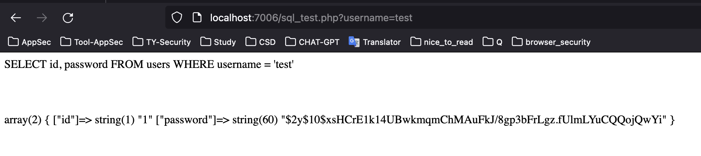
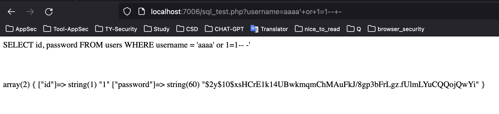
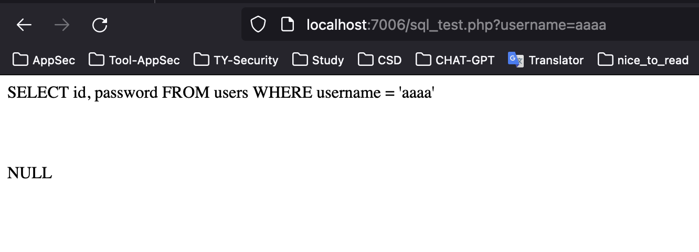

# PHP  - SQLi Vulnerable

SQLi;  kullanıcı tarafından kontrol edilen verilerin doğrudan SQL sorgularına eklenmesi nedeniyle ortaya çıkar.

```sql
<?php
session_start();
if ($_SERVER["REQUEST_METHOD"] == "GET")
 {

    // Database bağlantısı
    $conn = new mysqli("localhost", "root", "", "simple_web_app");

    if ($conn->connect_error)
    {
        die("Connection failed: " . $conn->connect_error);
    }
    // Post verilerini al
    $username = $_GET['username'];

    // SQL injection mevcut
    $sql = "SELECT id, password FROM users WHERE username = '$username'";
    echo $sql;
    
    echo "</br>";
    echo "</br>";
    $result = $conn->query($sql);
    $row = $result->fetch_assoc();
    echo "</br>";
    echo "</br>";
    var_dump($row);

    $conn->close();
}
?>
```






